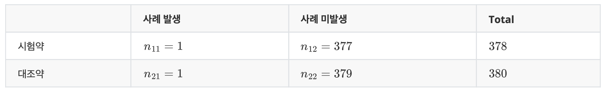

## 2x2 Contingency Table

Prospective Randomized study 



#### Sample Odds Ratio 

$$\hat{\Theta} = \frac{n_{11}n_{22}}{n_{12}n_{21}} = \frac{(1)(379)}{(377)(1)} = 1.00531$$

##### Interpretation

The estimated odds of AE occuring (사례발생) for someone taking 온베브지 is 1.00531 times more likely of AE occuring for someone taking 아바스틴. Since $\hat{\Theta} \approx 1$, there is no association between exposure group (drug) vs. outcome (AE occuring).

<div style="page-break-after: always;"></div>

#### Hypothesis Testing: Likelihood Ratio Test

If $\hat{\Theta} \gg 1$, then perform hypothesis test for statistical significance. 

데이터 및 변수 입력 cell:


```python
import pandas as pd

n_11 = 1
n_12 = 377
n_21 = 1
n_22 = 379

d = {"사례 발생" : [n_11, n_21], "사례 미발생" : [n_12, n_22]}
data = pd.DataFrame(d, index=["온베브지", "아바스틴"])

data
```


<div>
<style scoped>
    .dataframe tbody tr th:only-of-type {
        vertical-align: middle;
    }

    .dataframe tbody tr th {
        vertical-align: top;
    }

    .dataframe thead th {
        text-align: right;
    }
</style>
<table border="1" class="dataframe">
  <thead>
    <tr style="text-align: right;">
      <th></th>
      <th>사례 발생</th>
      <th>사례 미발생</th>
    </tr>
  </thead>
  <tbody>
    <tr>
      <th>온베브지</th>
      <td>1</td>
      <td>377</td>
    </tr>
    <tr>
      <th>아바스틴</th>
      <td>1</td>
      <td>379</td>
    </tr>
  </tbody>
</table>
</div>


Liklihood ratio test cell:


```python
from scipy.stats import fisher_exact

oddsr, p = fisher_exact(data, alternative='two-sided')
p
```


    1.0


Using significance level $\alpha = 0.05$

* If `p` < $0.05$, conclude that exposure (drug) and outcome (AE occuring) is **not** independent (reject $H_{0}$)
* If `p` > $0.05$, conclude that exposure (drug) and outcome (AE occuring) is independent (fail to reject $H_{0}$)

Example:
$p = 1 > 0.05 \implies$ exposure (drug) and outcome (AE occuring) is independent (i.e., no association)

<div style="page-break-after: always;"></div>

## 코드 실행 방법

1. Binder site 방문 (https://mybinder.org/):
    - GitHub 선택 확인 후 입력: `https://github.com/sion23/OddsRatio`
    - Git ref 입력: `main`
2. Launch (~1-5분 소유)
3. 원하시는 cell을 선택 (click)하시고 실행 (`Shift` + `Enter`) 하세요
